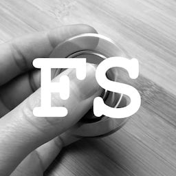

# [fidget-spinners.net](http://fidget-spinners.net)

> A big list of nice spinners

* [Local installation](#local-installation)
* [Building the website](#building-the-website)
* [Adding or updating a spinner](#adding-or-updating-a-spinner)
* [License](#license)

## Local installation

Get the project:

```shell
$ git clone git@github.com:johansatge/fidget-spinners.net.git
$ cd fidget-spinners.net.git
```

Make sure you have Node 8:

```
$ node -v
v8.9.0
```

Install the NPM dependencies:

```shell
$ npm install
```

## Building the website

To build the website (in the `./dist` directory), run:

```
$ npm run build
```

It will:

* Read the spinners list (see below) and generate the corresponding HTML
* Compile and inline the CSS styles from `src/sass`
* Compile and inline the JS scripts from `src/js`
* Minify the final HTML and write the file

Also, when working on files in `src/`, a _watch_ task is available; it will generate the HTML on every file change:

```
$ npm run watch
```

## Adding or updating a spinner

The spinners list is stored in the [`spinners/spinners.json`](spinners/spinners.json) file.

Its structure looks like this:

```json
{
  ...
  "company_name": {
    "url": "http://company.url/",
    "name": "Company Name",
    "models": [{
      "name": "Company's spinner 1",
      "file": "spinner1.jpg",
      "price": "123",
      "added": "2017-03-20"
    },
    {
      "name": "Company's spinner 2",
      "file": "spinner2.jpg",
      "price": "456",
      "added": "2017-03-20"
    }]
  },
  ...
}
```

Each spinner has associated images, stored in `spinners/images/company_name`:

* `spinners/images/company_name/spinner1.jpg` → Full-size image (`500x500` or `800x800` square)
* `spinners/images/company_name/spinner1_thumb@2x.jpg` → Retina thumbnail (`400x400` square)
* `spinners/images/company_name/spinner1_thumb.jpg` → Standard thumbnail (`200x200` square)

Update the `json` file and rebuild the HTML to see the result.

> To automatically generate thumbnails for a given brand, the [build_thumbnails.php](src/build_thumbnails.php) tool is available (to be converted to a NPM script).
> It needs [jpegoptim](https://github.com/tjko/jpegoptim) to work.

## License

This project is released under the [MIT License](license.md).
